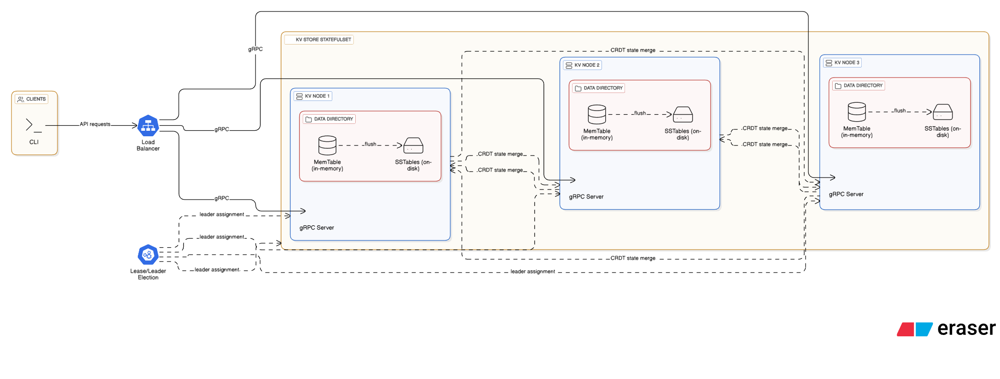

# zynk

Zynk is a Rust-based distributed key–value store prototype. It uses gRPC for client/server and inter-node communication, a Kubernetes Lease to elect a single coordinator, and a simple load balancer to front multiple nodes. Conflict-free data types (CRDTs) are included for eventually consistent replication.

## Architecture and Design

Zynk comprises a set of Kubernetes-managed Rust services that together provide a scalable, eventually consistent key–value store. A StatefulSet of `zynkd` nodes expose a gRPC API and persist data locally using an embedded LSM-based storage engine. A single node acts as the coordinator at any time, elected via a Kubernetes `Lease` object. The coordinator is responsible for control-plane duties (e.g., background anti-entropy), while all nodes serve read/write traffic. A lightweight gRPC load balancer (`zynk-lb`) fronts the node set and handles client-facing traffic routing.

On the data path, requests are served by `zynkd` and persisted to disk using write-optimized structures (memtable + SSTables). For replicated data types, Zynk leverages state-based CRDTs: each CRDT instance (e.g., a grow-only set or a replicated list) can be serialized to bytes and merged deterministically with a peer’s state. This design guarantees convergence under concurrent, out-of-order, and duplicate deliveries without requiring consensus for every write.

On the control path, leader election is implemented with in-cluster authentication (ServiceAccount token and cluster CA) and raw HTTP operations against the Kubernetes API. Nodes PATCH the `Lease` resource periodically using RFC3339 microsecond timestamps with `Z` to renew leadership. The holder identity recorded in the Lease defines the active coordinator. This integrates natively with Kubernetes RBAC and keeps the control plane simple, observable, and failure-resilient.

For deployment, all components are described declaratively using Kustomize resources, including RBAC (ServiceAccount, Role, RoleBinding), a headless Service for stable pod DNS, the `Lease` object for coordination, and the `zynk-lb` Deployment. A Makefile streamlines the local development loop in Minikube by building a tagged image, loading it into the cluster runtime, updating workload images, and applying manifests.

## Storage and Consistency
  - Embedded LSM-based engine for key–value persistence:
    - Write path: writes are absorbed into an in-memory memtable optimized for sequential inserts; once size thresholds are reached, the memtable is flushed to immutable, sorted SSTable segments on disk.
    - Read path: point lookups check the memtable first, then descend into SSTables; metadata tracks segment ordering to minimize disk touches.
    - Durability and ordering: data is maintained in sorted order by key; deletes create tombstones that are cleaned up during compaction, ensuring monotonic visibility semantics.
    - Storage layout: per-node `DATA_DIR` (default `/data`) holds the manifest and SSTable files for predictable restart behavior inside Kubernetes pods.
  - CRDT library provides state-based types (e.g., Grow-only Set, Replicated Growable Array) with deterministic `merge()` and serialization.
  - Eventual consistency via state-based CRDTs (associative, commutative, idempotent merges).
  - Nodes can exchange serialized CRDT states and merge locally to converge.

---

## Deploy and Verify

Prerequisites
- Minikube or a Kubernetes cluster
- Docker, kubectl, and Rust toolchain (for local builds)

Build and deploy (Minikube)
- Build an image with a unique tag, load it into Minikube, update workloads, and apply manifests:
  - `make TAG=vYYYY-MM-DD-HHMM all`
  - `make deploy`

Validate the deployment
- Watch pods: `kubectl get pods -w`
- Check leader identity: `kubectl get lease zynk-coordinator -o jsonpath='{.spec.holderIdentity}'; echo`
- Inspect recent logs on each node (look for leader/follower messages):
  - `kubectl logs zynkd-0 --since=2m`
  - `kubectl logs zynkd-1 --since=2m`
  - `kubectl logs zynkd-2 --since=2m`
